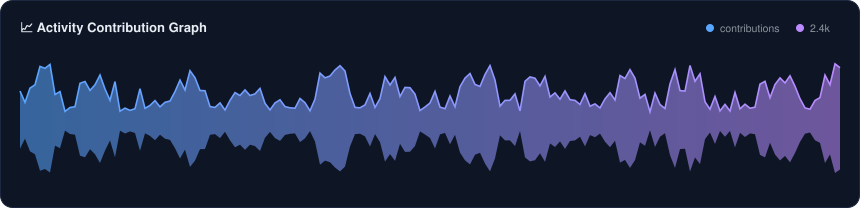
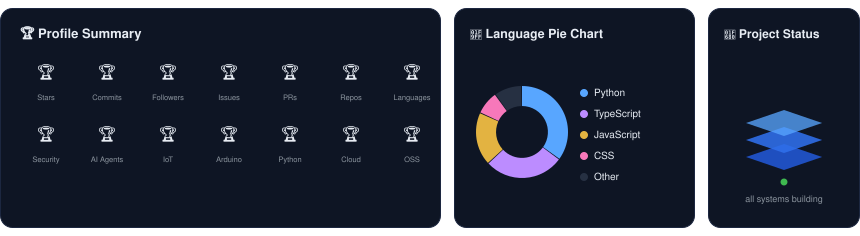
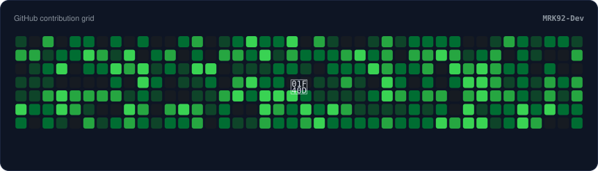

<h3 align="center">Hi, I'm Muhammad Arshad Khan 👋</h3>

  Full-Stack Developer · Cyber Security Enthusiast · AI Agent &amp; IoT Builder 
  Turning ideas into clean, secure, production-ready code.

  
  
  
  

---

### 🧑‍💻 About Me

I'm a full-stack developer from Pakistan who enjoys working across the whole stack —
from **embedded firmware** on ESP32/Arduino boards to **secure web applications** and
**AI-powered automation** in the cloud. I write clean, documented code and ship
projects that solve real problems.

- 🔭 Currently building: **AI agents & IoT dashboards**
- 🛡️ Focused on: **application & network security, secure coding practices**
- 🌱 Learning: **advanced penetration testing & cloud architecture**
- 🤝 Open to: **freelance projects, collaborations & open source**

---

### 🎯 Areas of Expertise

| Cyber Security | AI & Automation | Embedded & IoT | Full-Stack Web |
|:---:|:---:|:---:|:---:|
| Pen-testing & hardening | LLM agents & workflows | ESP32 firmware | React & Node.js |
| Network security | Python automation | Arduino Uno projects | REST / GraphQL APIs |
| OWASP Top-10 | Prompt engineering | Sensors & robotics | PostgreSQL & Firebase |
| Secure code reviews | Data pipelines | Wi-Fi / BLE systems | Docker & CI/CD |

---

### 🧰 Tech Stack

**Languages**

**Web & Backend**

**Cloud, DevOps & Security**

**Embedded & AI**

---

### 💼 What I Can Do For You

- 🔐 **Security assessments** — scripts, hardening checklists & secure-code reviews
- 🐍 **Python development** — automation, scrapers, bots, APIs & data pipelines
- 🤖 **AI agents** — custom LLM-powered assistants & workflow automation
- 📡 **IoT projects** — ESP32 / Arduino firmware, sensor networks & live dashboards
- 🌐 **Web applications** — full-stack builds from idea to deployment
- ☁️ **DevOps** — Docker, CI/CD pipelines & cloud setup on AWS

---

### 📊 Performance Dashboard

<picture>
  <source media="(prefers-color-scheme: dark)" srcset="assets/snake/github-contribution-grid-snake-dark.svg" />
  
</picture>

---

### 📫 Get In Touch

I'm open to freelance work, collaborations and interesting open-source ideas —
feel free to reach out through GitHub, or connect with me on LinkedIn.

  
  

  ⚡ Powered by curiosity, caffeine & clean commits

