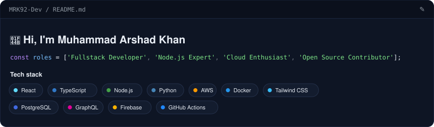
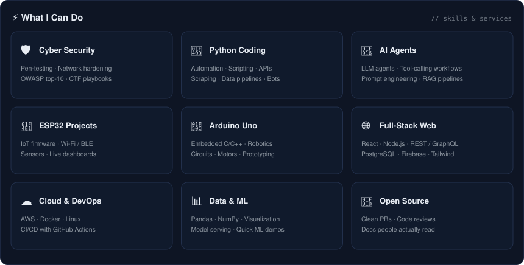
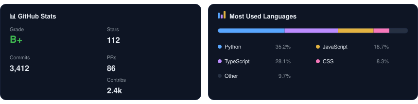

<!--
  Muhammad Arshad Khan — dark-dashboard profile README
  · Panels are self-contained SVGs, regenerate with:
      python3 assets/scripts/generate_profile_svgs.py
  · The contribution snake is refreshed automatically by
      .github/workflows/snake.yml
-->

<picture>
  <source media="(prefers-color-scheme: dark)" srcset="assets/snake/github-contribution-grid-snake-dark.svg" />
  
</picture>
